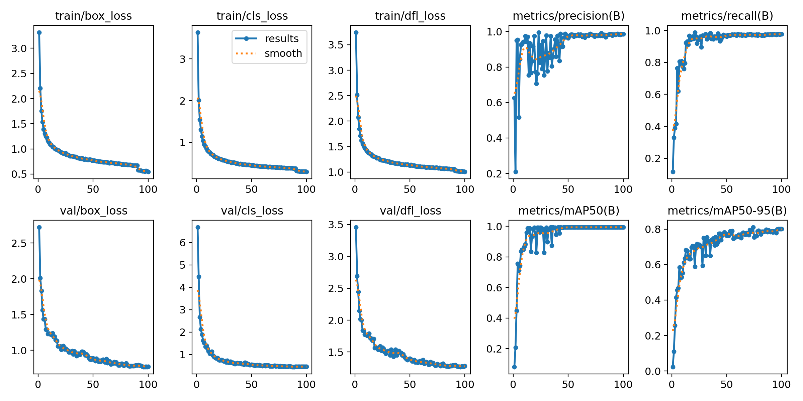
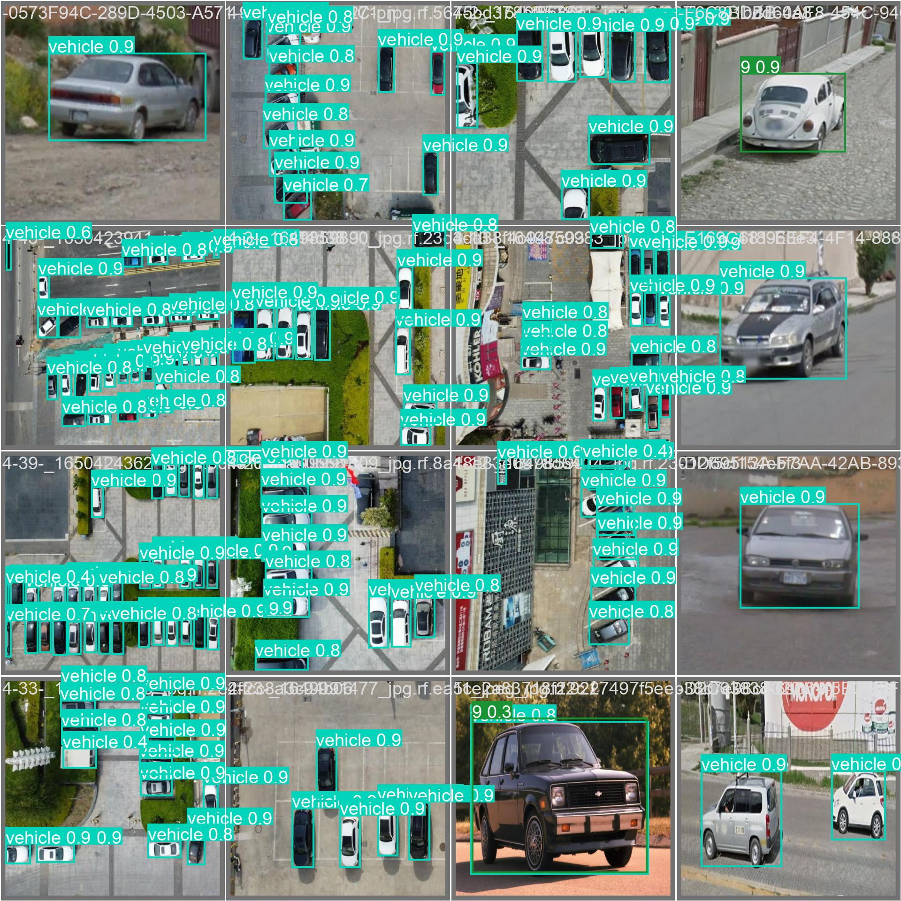
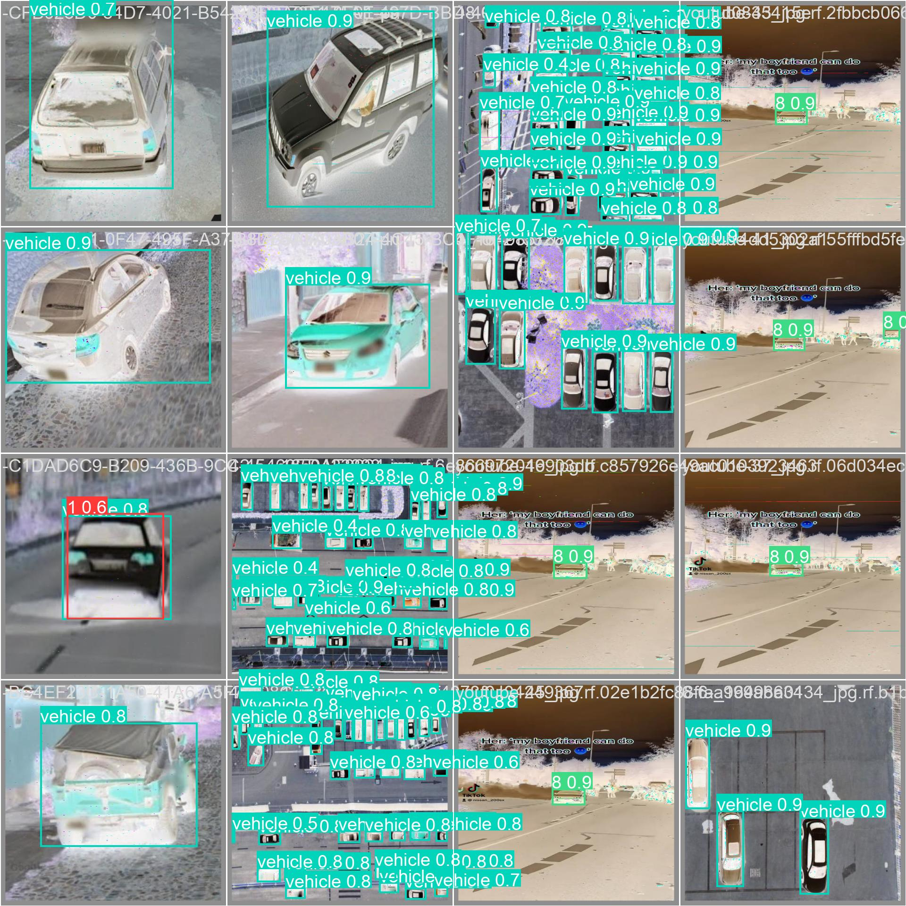
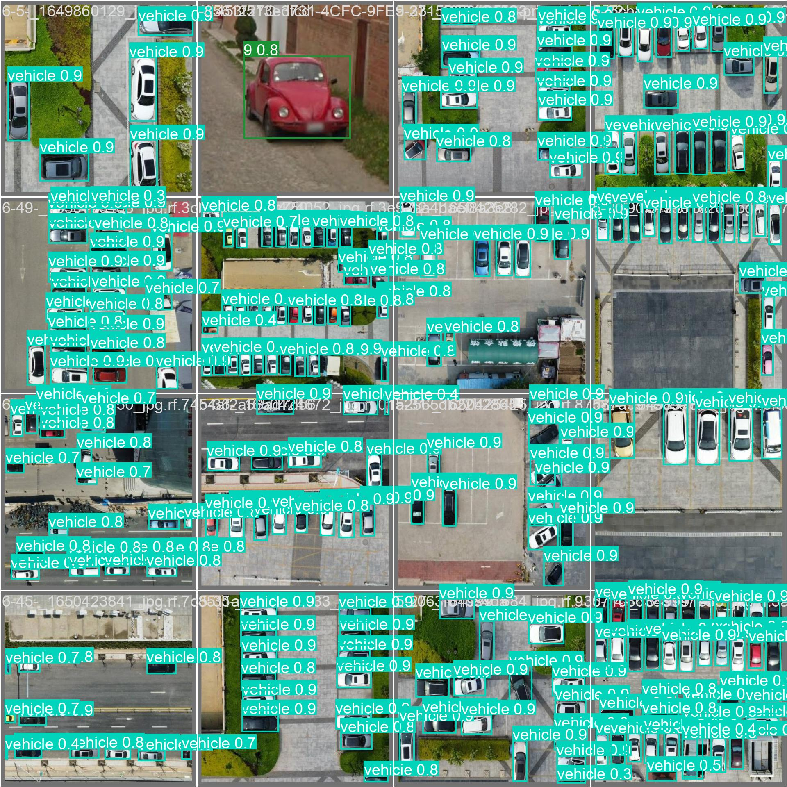

# Embedded AI HW4 Report

## Dataset

The following dataset is chosen: https://universe.roboflow.com/hubert-ang-usedk/vehicle-detection-using-drone. It
contains 3423 training, 101 validation and 44 test images for vehicle detection. Some of them are thermal images.

## Running YOLOv8 training on OrangePi

```shell
pip install roboflow ultralytics==8.0.196
ROBOFLOW_API_KEY={YOUR API KEY HERE} python3 main.py
```

### Chosen Parameters

* Epochs: 100
* Image size: 640x640

Both are default YOLOv8

### Training time

In total, training process took 100 hours (1 hour per each epoch).

### Metrics



As we can see both training and validation losses have decreased as expected.

### Example results




